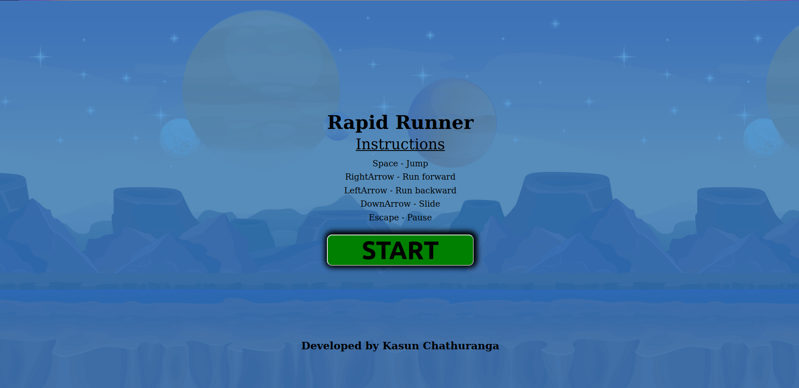
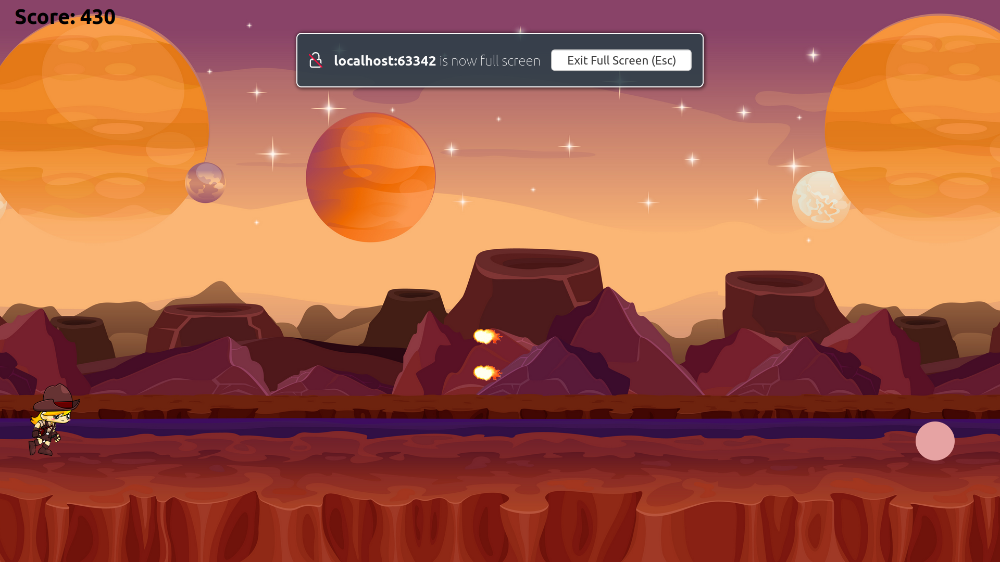
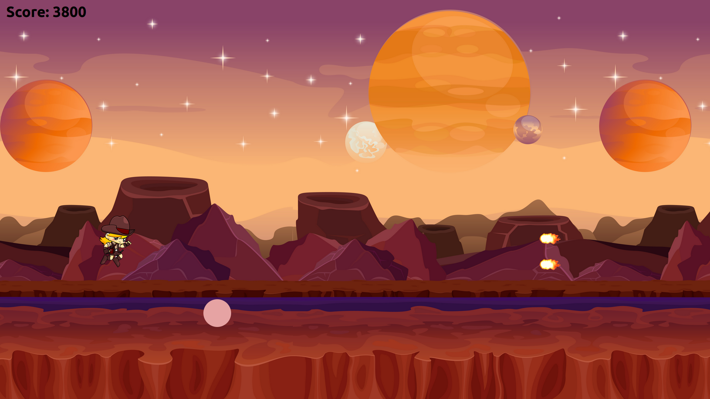
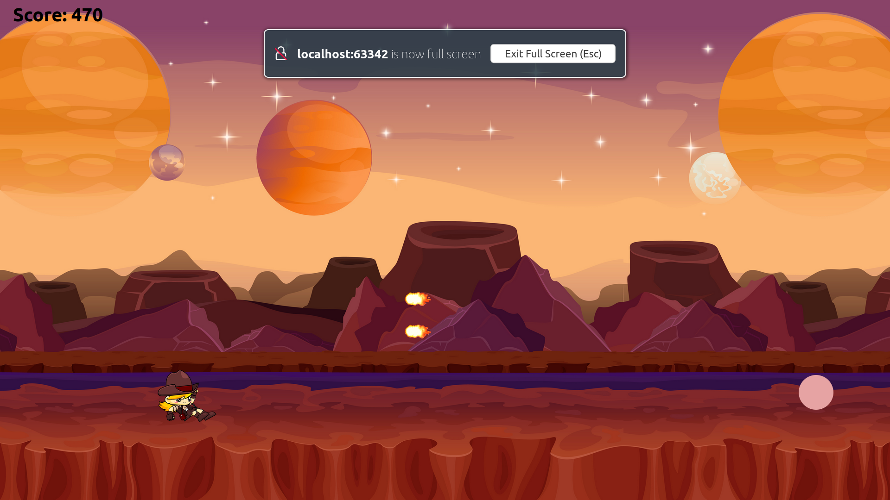
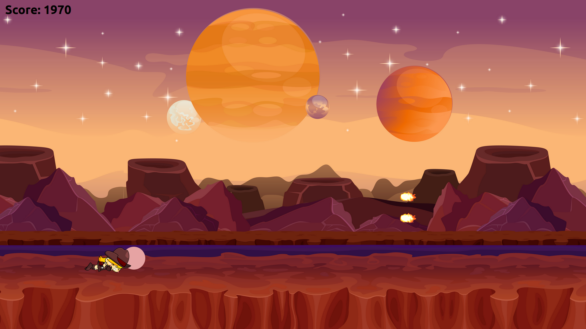
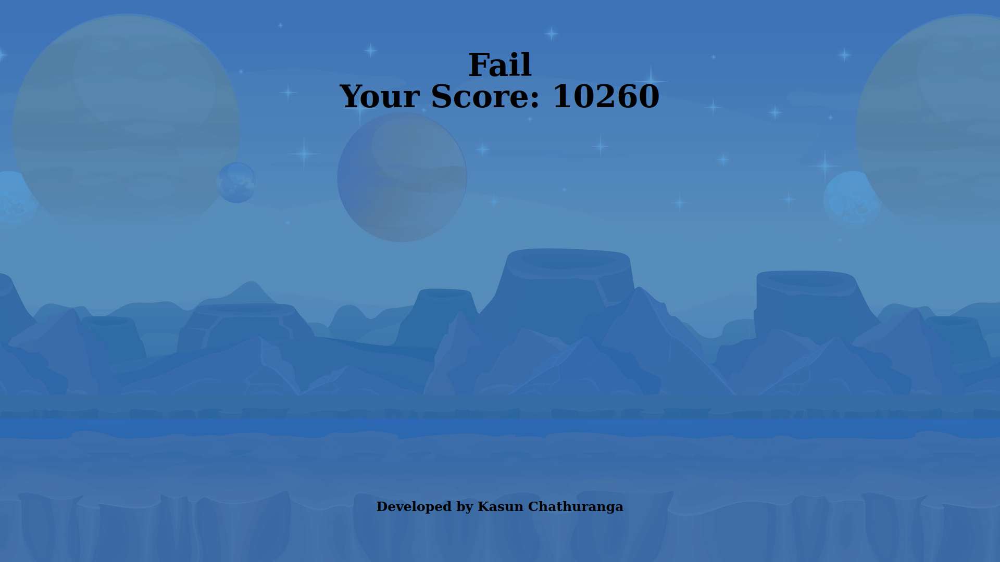
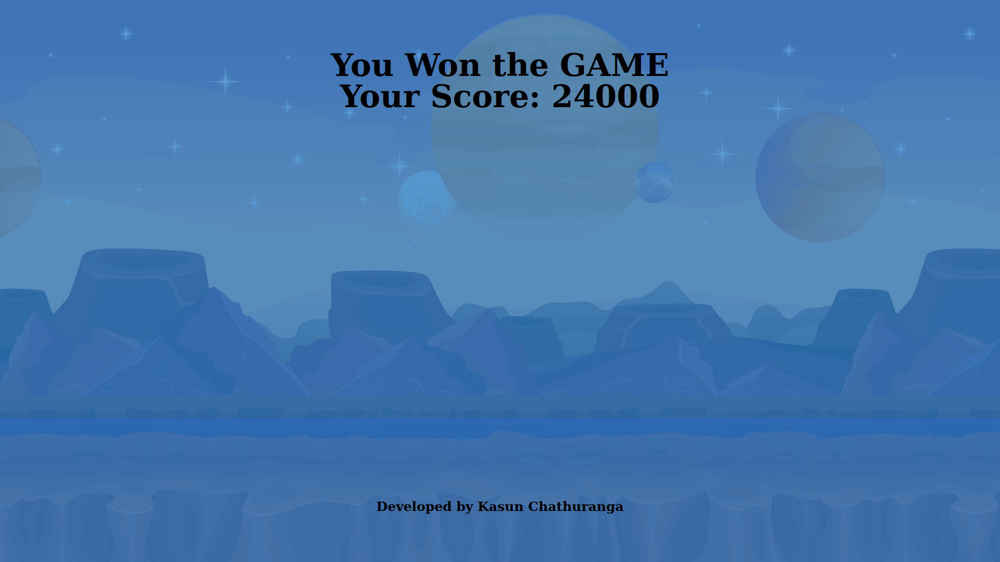

# Rapid Runner

Rapid Runner is an exciting web-based mini-game specifically designed for full-screen desktop gaming experiences. It offers a thrilling and fast-paced gameplay that takes advantage of the larger screen size and immersive environment that desktop computers provide. Created using JavaScript, Web API, and DOM API, Rapid Runner delivers an engaging and interactive gaming experience right in your browser.

Rapid Runner is designed to challenge players' reflexes, agility, and decision-making skills as they strive to beat their own high scores and compete with others. Whether you're looking for a quick gaming session or a thrilling way to pass the time, Rapid Runner offers a captivating experience right from your web browser.

## Technologies and Tools Used

- JavaScript Basics
- DOM API
- Web API

## Getting Started

To get started with the Rapid Runner mini-game, follow these steps:

1. Clone the repository: `git clone https://github.com/KasunChathuranga3732/mini-game.git`
2. Set up the necessary configurations.
3. Install the required dependencies and libraries.
4. Open index.html file and play.

## License

Copyright &copy; 2023. All Rights Reserved.

## Contact

For any inquiries or support, please contact [Kasun Chathuranga](mailto:kasunchathuranga3732@gmail.com).

## Screen Shots
### Start

### Run

### Jump

### Slide

### Dead

### Fail

### Won

